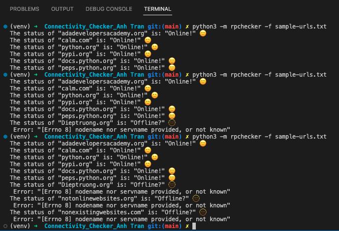

# Build a Site Connectivity Checker in Python
[](https://www.python.org)

- RP Checker is a site connectivity checker utility
- It takes one or more website URLs and checks if those sites are online.
- It can perform the connectivity checks either synchronously or asynchronously.

## Learning Goals
Major things that I want to focus on learning in this project
- Using Python to create a site connectivity checker ultility
- Using bPython to write and check code in Terminal
- Learning to  synchoronously and asynchronously

## Technology
- Python 3.11
- Venv

## Installation
```bash
pip3 install -r requirements.txt
```

## Usage
(venv) $ python -m pip install -r requirements.txt

## ScreenShot
<p align="center">
  
</p>

## Connect with me!

[](https://linkedin.com/in/annieyentran/)  [](https://github.com/momofAnAl)

## Email Me :e-mail:
[](mailto:anhtr077@gmail.com)